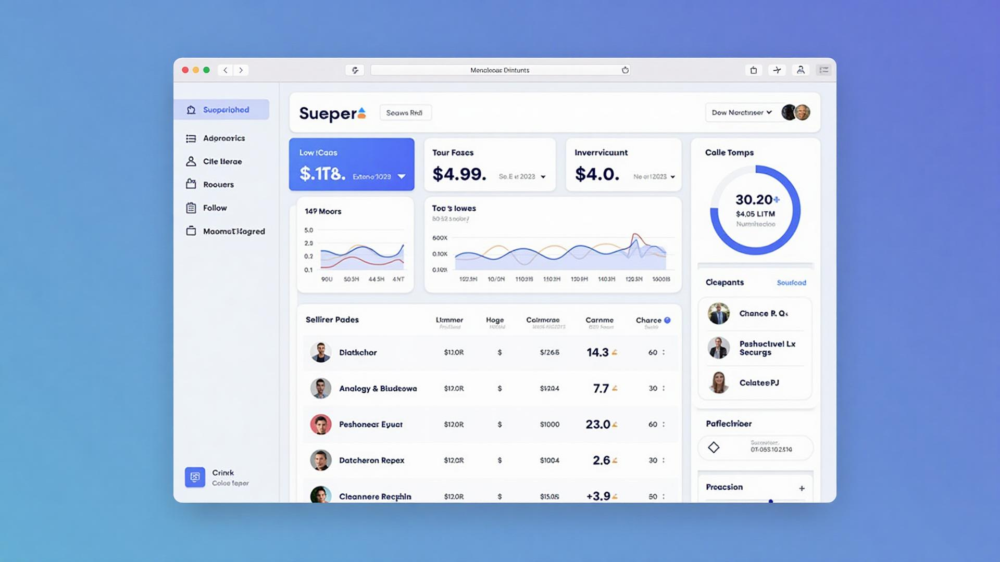

# 🏪 Estoque Manager

Sistema completo de gestão de estoque, compras e vendas (PDV) para pequenas e médias empresas, com interface moderna estilo Apple e conformidade total com LGPD.



## 🎯 Visão Geral

O **Estoque Manager** é um SaaS web totalmente em português (pt-BR) que oferece uma plataforma completa para gestão empresarial, incluindo:

- **PDV (Ponto de Venda)** com funcionalidade offline
- **Gestão de Estoque** com controle automático FEFO
- **Compras e Entradas** com gestão de fornecedores
- **Relatórios e BI** com dashboards em tempo real
- **Multi-tenant** seguro com conformidade LGPD
- **PWA** responsivo para dispositivos móveis

## ✨ Características Principais

### 🎨 Design Apple-like
- Interface clean, minimalista e elegante
- Micro animações suaves e responsividade total
- Tipografia Inter e design system consistente
- Componentes shadcn/ui customizados

### 🔒 Segurança e Conformidade
- **Multi-tenant** com isolamento de dados por empresa
- **LGPD** compliance com consentimento explícito
- **Auditoria** completa de ações dos usuários
- **RLS (Row Level Security)** no banco de dados

### 📱 PWA e Mobile
- Aplicativo web progressivo (PWA)
- Funcionalidade offline no PDV
- Sincronização automática ao reconectar
- Interface otimizada para tablets e smartphones

## 🚀 Funcionalidades

### 🛒 PDV (Ponto de Venda)
- Scanner de código de barras/QR
- Múltiplas formas de pagamento (Dinheiro, Cartão, Pix)
- Carrinho com descontos percentuais
- Emissão de recibos PDF
- Funcionamento offline com fila de sincronização

### 📦 Gestão de Estoque
- Controle automático com baixa por venda
- Sistema FEFO (First Expired, First Out)
- Alertas de validade e baixo estoque
- Importação CSV e exportação Excel
- Histórico completo de movimentações

### 🛍️ Compras e Entradas
- Cadastro de produtos e fornecedores
- Controle de lotes e validades
- Gestão de custos para cálculo de CMPP
- Entradas automáticas com atualização de estoque

### 📊 Relatórios e BI
- Dashboard com KPIs em tempo real
- Gráficos de vendas e análises de tendência
- Relatórios de produtos ativos
- Exportação em PDF e Excel

### 🧾 Integração NF-e
- Configuração para emissão de NF-e
- Ambiente de homologação/mock
- Armazenamento de XMLs e PDFs
- Tratamento de rejeições com retry

## 🏗️ Arquitetura Técnica

### Stack Principal
- **Frontend**: React 18 + TypeScript + Vite
- **Styling**: Tailwind CSS + shadcn/ui
- **Routing**: React Router Dom
- **State**: React Query + Zustand (preparado)
- **UI**: Componentes customizados estilo Apple

### Design System
- **Cores**: HSL com tokens semânticos
- **Tipografia**: Inter font family
- **Animações**: Transições suaves com cubic-bezier
- **Componentes**: Variants customizados do shadcn
- **Layout**: Grid responsivo e mobile-first

### Banco de Dados (Preparado para Supabase)
```sql
-- Principais entidades
- Company (multi-tenant)
- User + Membership (RBAC)
- Product + InventoryBatch
- Sale + SaleItem
- Purchase + PurchaseItem
- StockMovement (auditoria)
- Subscription (billing)
- AuditLog (LGPD)
```

## 🎮 Como Usar

### Desenvolvimento Local
```bash
# Instalar dependências
npm install

# Executar em modo desenvolvimento
npm run dev

# Build para produção
npm run build
```

### Navegação
- **Landing Page**: `/` - Página inicial com hero, features e preços
- **Login**: `/login` - Tela de autenticação
- **Dashboard**: `/dashboard` - Painel principal com KPIs e ações rápidas

## 💼 Planos e Monetização

### 📋 Planos Disponíveis
1. **Essencial** - R$ 300/mês
   - PDV completo + Gestão básica
   - Até 2 usuários
   - Relatórios básicos

2. **Profissional** - R$ 500/mês
   - Tudo do Essencial + IA
   - Usuários ilimitados
   - Relatórios avançados com previsão de demanda

### 🎁 Trial e Onboarding
- **7 dias grátis** com todas as funcionalidades
- **Onboarding guiado** pós-registro
- **Setup em 5 minutos** sem cartão de crédito

## 🔮 Próximos Passos

### Para produção completa seria necessário:

1. **Backend Integration**
   - [ ] Conectar Supabase para auth e database
   - [ ] Implementar edge functions para lógica de negócio
   - [ ] Configurar RLS policies para multi-tenant

2. **Funcionalidades Avançadas**
   - [ ] Integração real com Stripe/pagamentos
   - [ ] NF-e em ambiente de produção
   - [ ] Scanner de código de barras (camera API)
   - [ ] Service Workers para PWA offline

3. **IA e Analytics**
   - [ ] Previsão de demanda com ML
   - [ ] Análise automática de tendências
   - [ ] Alertas inteligentes

4. **Performance e Scalability**
   - [ ] Otimização de bundle size
   - [ ] Lazy loading de componentes
   - [ ] CDN para assets estáticos

## 🎨 Design Tokens

O sistema usa tokens semânticos definidos em `src/index.css`:

```css
/* Cores principais */
--primary: 214 95% 56%;          /* Azul moderno */
--success: 142 76% 36%;          /* Verde para sucessos */
--warning: 38 92% 50%;           /* Amarelo para alertas */
--destructive: 0 72% 51%;        /* Vermelho para erros */

/* Gradientes */
--gradient-primary: linear-gradient(135deg, hsl(214 95% 56%), hsl(214 95% 46%));
--gradient-hero: linear-gradient(135deg, hsl(214 95% 56% / 0.1), hsl(240 5% 96% / 0.5));

/* Sombras Apple-like */
--shadow-apple: 0 10px 15px -3px hsl(240 6% 10% / 0.1);
```

## 📄 Licença

Este projeto foi desenvolvido como MVP demonstrativo para o **Estoque Manager**. 

---

**Estoque Manager** - Gestão Inteligente de Estoque e Vendas 🚀